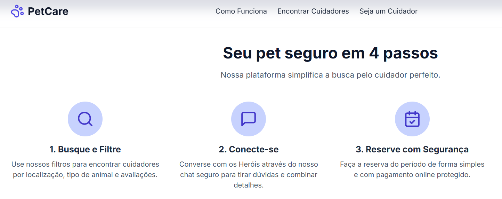

# PetCare 🐾

## Sobre o Projeto

PetCare é uma plataforma online desenvolvida para conectar tutores de animais de estimação a cuidadores apaixonados e confiáveis. 

## Funcionalidades Principais

  * **Cadastro e Autenticação:** Sistema de login e cadastro seguro para tutores e cuidadores.
  * **Perfis Detalhados:** Cuidadores podem criar perfis completos, exibindo suas habilidades, experiência, fotos e avaliações.
  * **Busca Inteligente:** Tutores podem encontrar cuidadores com base em localização, disponibilidade, tipo de animal e serviços oferecidos.
  * **Sistema de Agendamento:** Ferramenta para solicitar, aceitar e gerenciar agendamentos de cuidados.
  * **Avaliações e Comentários:** Tutores podem avaliar os serviços prestados, construindo uma comunidade baseada na confiança.

## Tecnologias Utilizadas

O projeto foi construído utilizando tecnologias modernas e robustas para garantir performance e escalabilidade.

### **Backend**

  * **Java:** Linguagem principal para o desenvolvimento do servidor.
  * **Spring Boot:** Framework para a criação de aplicações Java de forma rápida e eficiente.
  * **Maven:** Para gerenciamento de dependências.

### **Frontend**

  * **ReactJS:** Biblioteca JavaScript para a construção da interface de usuário.

### **Banco de Dados**

  * **MySQL:** Sistema de gerenciamento de banco de dados relacional para armazenar todas as informações da plataforma.

